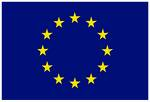

# Gap Fill Evaluation Tool

This project has received funding from the European Union’s Horizon 2020 research and innovation programme under grant agreement No 825299. 

This tool was built as part of the [GoURMET Project](https://gourmet-project.eu/) to complete Gap Fill evaluation on machine translation models and is open sourced under GPL v3. Issues should be raised via the GitHub issues. Code changes can be proposed by opening a pull request.

## Contents

1. [What is Gap Fill?](#what-is-gap-fill)
2. [Admin Guide](./docs/admin.md)
3. [Developer Guide](./docs/development.md)
4. [User Guide](./docs/users.md)

## What is Gap Fill

[Gap Fill Evaluation](https://arxiv.org/abs/1809.00315) is a standard evaluation approach used in academic research to assess the quality of translation. This approach differs from automatic evaluation such as [BLEU](https://en.wikipedia.org/wiki/BLEU) as the evaluation is carried out by a human rather than an algorithm. The goal of Gap Fill is to evaluate a translation model by asking a human to fill in the gaps in a sentence that has been translated by a human using the machine translation of the same sentence as a guide to what words should go in that sentence.

To complete [Gap Fill Evaluation](https://arxiv.org/abs/1809.00315) the user is presented with a series of segments. For each segment there is an original segment in the source language there is also a translation of that segment that has been translated by a human and a translation of that segment that has been translated by a machine translation system.

The evaluator will be presented with the full segment that has been translated by a human and the machine translated segment with gaps in. They will be asked to 'fill in the gaps' in the machine translated segment using the human translated segment as a 'hint'.  The evaluator fills in the gaps and based on how closely their answers match the missing word the quality of the translation model can be assessed.
