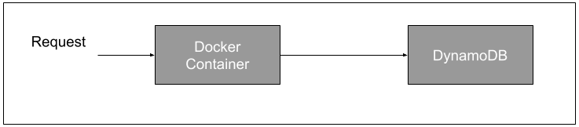
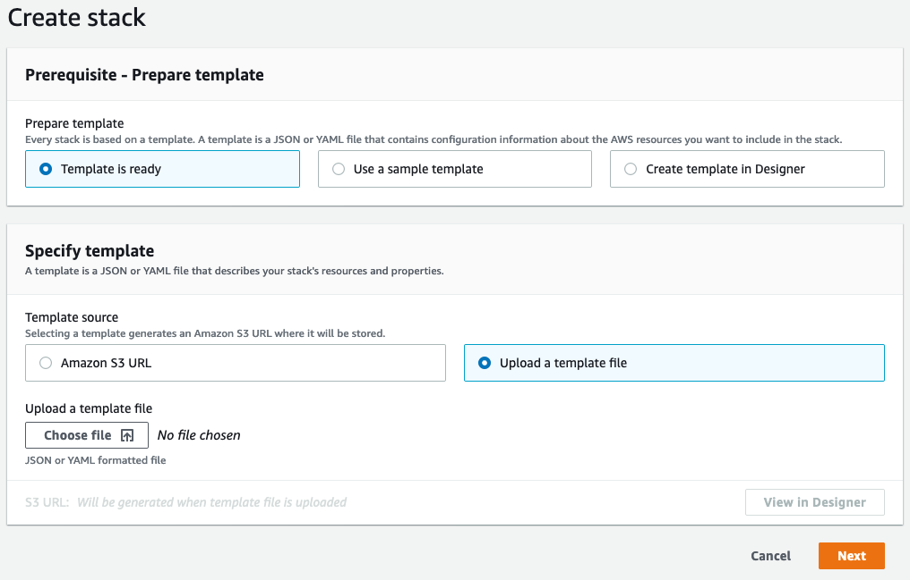
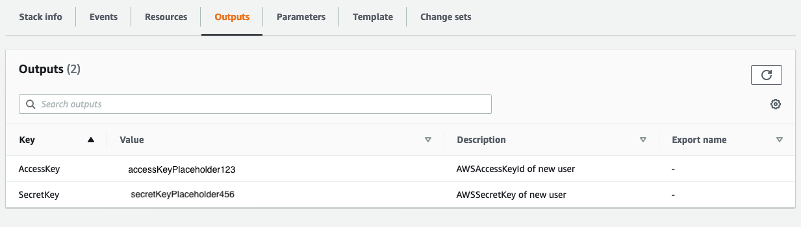

# Admin Guide

This guide describes the administration tasks required to set up and use the Gap Fill Tool for carrying out Direct Assessment This tool is open sourced under GPL v3. Issues should be raised via the GitHub issues. Code changes can be proposed by opening a pull request.

To use the tool a database and client need to be set up as well as credentials to allow the client to connect to the database

## Prerequisites

1. [AWS Account](https://aws.amazon.com/premiumsupport/knowledge-center/create-and-activate-aws-account/)
2. [Docker](https://docs.docker.com/get-docker/) installed on your machine.

## Solution Pricing

The database used is [DynamoDB](https://aws.amazon.com/dynamodb/) this is a paid for AWS Service please be aware of the [costs](https://aws.amazon.com/dynamodb/pricing/) of database reads and writes before creating and using tables.

## Architecture



## Database set up

The database used to store data is [DynamoDB](https://aws.amazon.com/dynamodb/). This is an AWS service to the database will need to be created in AWS https://aws.amazon.com/.

### Create Databases

1. Create an AWS account
2. The [Cloudformation](https://aws.amazon.com/cloudformation/) service can be used to create all tables needed by the client. The 'create stack' feature needs to be used and `Upload a template file` should be used to specify the infrastructure for the databases. The template is provided in  [infrastructure/templates/dynamoDB.json](../infrastructure/templates/dynamoDB.json). The default values can be used.



The cloudformation step will create the relevant DynamoDB tables in AWS.

### Create Database Credentials

In order to allow client to access the DynamoDB database an [access key](https://aws.amazon.com/premiumsupport/knowledge-center/create-access-key/) is required. An access key is made up of an Access Key Id and Secret Access Key. To do create this an AWS [IAM User](https://docs.aws.amazon.com/IAM/latest/UserGuide/introduction_identity-management.html) must also be created. This can be done using a provided cloudformation template

1. Use the same AWS account that the Databases were created in
2. The [Cloudformation](https://aws.amazon.com/cloudformation/) service can be used to create an Access Key Id and Secret Access Key. The 'create stack' feature needs to be used and `Upload a template file` should be used to specify the infrastructure for the databases. The template is provided in [infrastructure/templates/IAM.json](../infrastructure/templates/IAM.json). A password needs to be provided The password will allow an individual to log into AWS via the [AWS Console](https://aws.amazon.com/console/) with the IAM username `DynamoDBAccess` and the password specified.
3. The output tab will show the Access Key Id and Secret Access Key (note the credentials shown in the image below are not valid)



## Setting up the Client 

The client app is available as a Docker image from [https://hub.docker.com/r/newslabsgourmet/gap-fill-tool](https://hub.docker.com/r/newslabsgourmet/gap-fill-tool)

1. Pull the image using 

```docker pull newslabsgourmet/gap-fill-tool```

2. Use the Docker run to start a container from the image

```docker run -p 8080:8080 -e AWS_ACCESS_KEY_ID=AWS_KEY_ID -e AWS_SECRET_ACCESS_KEY=AWS_SECRET_ACCESS_KEY newslabsgourmet/gap-fill-tool```

There are multiple parameters that need to be provided to the run command:

* -p 8080:8080 This exposes the application on port 8080
* -e AWS_ACCESS_KEY_ID=AWS_KEY_ID Provide the secret access key ID created when creating DynamoDB credentials
* -e AWS_SECRET_ACCESS_KEY=AWS_SECRET_ACCESS_KEY Provide the secret access key created when creating DynamoDB credentials

3. The Gap Fill App will now be running on [http://localhost:8080](http:localhost:8080) using the DynamoDB created in AWS for storage.
