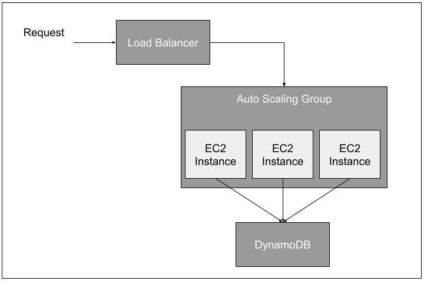

# Developing the Gap Fill Evaluation Tool

Documentation for working on the tool as a developer.

# Set up
1. Install [node v10](https://nodejs.org/en/)
2. Run `yarn install`
3. Set up pre-commit hook `./githooks/setupHooks.sh` (optional but useful)

## Pre-commit Hook

[What are git hooks](https://githooks.com/)

This project has a pre commit hook which if set up (run the setup hooks script `./githooks/setupHooks.sh`) will run the linter, TypeScript compiler and tests that will be effected by the changes made. If you need to ignore the hook at any point use the `--no-verify` flag e.g. `git commit --no-verify`

# Running the App

The app requires local aws credentials for the GoURMET AWS account.

Run `yarn dev`

The app talks directly to DynamoDB tables in AWS

# Developing the App.

## BBC Infrastructure

The BBC runs the app on the following infrastructure:



This infrastructure is BBC specific and created using Cloudformation templates.

## Cloudformation

The following Cloudformation templates are available in [infrastructure/templates](../infrastructure/templates):

- main.json: BBC Specific Architecture for setting up the EC2 instances, autoscaling group and load balancer.
- dns.json: BBC Specific Architecture for creating a DNS Record
- logs.json: General Architecture for setting up logging
- IAM.json: General Architecture for creating an IAM user that can access DynamoDB
- dynamoDB.json: General Architecture for creating the DynamoDB tables used by the tool.

While some are general purpose some are BBC specific. However the BBC specific ones can be used as guidance when setting up architecture if the same set up is required as show in the [BBC Infrastructure Diagram](#bbc-infrastructure).

### Updating the Templates

The Cloudformation templates are generated using [cosmos-troposphere](https://github.com/bbc/cosmos-troposphere). This will need to be installed locally in order to update the Cloudformation template. How to install this is covered in the [cosmos-troposphere README](https://github.com/bbc/cosmos-troposphere/blob/master/README.rst). Alternatively run `make venv` from within the `infrastructure` directory to set up an virtual environment and install cosmos-troposphere.

To make changes to the stack. Update the [./infrastructure/src/main.py](../infrastructure/src/main.py) and run `make templates/main.json` from inside the `infrastructure` directory. The updated template will be generated in the [infrastructure/templates](../infrastructure/templates) directory.

## Databases

The app uses DynamoDB to store data. These are created using the DynamoDB [Cloudformation Template](../infrastructure/templates/dynamoDB.json). To make changes to the database update the [../infrastructure/src/dynamoDB.py](../infrastructure/src/dynamoDB.py) and run `make templates/dynamoDB.json` from inside the `infrastructure` directory. The updated template will be generated in the [infrastructure/templates](../infrastructure/templates) directory.

### Database Tables

The names of the database tables are in the [`.env`](../.env) file. There are 3 tables

1. SEGMENT_SETS_TABLE_NAME - Contains the sets of segments to be evaluated

| setId  | name   | segmentIds  | sourceLanguage | targetLanguage | evaluatorIds |possibleEvaluatorIds|
|--------|--------|-------------|----------------|----------------|--------------|--------------------|
| string | string | string set  | string         | string         | string set   |string set          |

2. SEGMENTS_TABLE_NAME - Contains the segments. Each segment has an original sentence in the source language as well as a translation into the target language done by a human and another done by a machine (this is the hint).

| id     | context | correctAnswers | entropyMode | gapDensity | hint   | problem | source | sourceLanguage | targetLanguage | translation | translationSystem |
|--------|---------|----------------|-------------|------------|--------|---------|--------|----------------|----------------|-------------|-------------------|
| string | string  | string         | string      | string     | string | string  | string | string         | string         | string      | string            |

3. SEGMENT_SET_ANSWERS_TABLE_NAME - Contains answers given, which segment it was and which evaluator completed the task.

| answerId | answers | correctAnswers | evaluatorId | hint   | problem | source | sourceLanguage | segmentId | translation | translationSystem | timeTaken | timestamp |
|----------|---------|----------------|-------------|--------|---------|--------|----------------|-----------|-------------|-------------------|-----------|-----------|
| string   | string  | string         | string      | string | string  | string | string         | string    | string      | string            | number    | number    |

### DNS

The BBC has a BBC specific URL associated with the project when in production. This is created using the DNS template. To make changes to the DNS template update the [./infrastructure/src/dns.py](../infrastructure/src/dns.py) and run `make templates/dns.json` from inside the `infrastructure` directory. The updated template will be generated in the [infrastructure/templates](../infrastructure/templates) directory.

This is not relevant if running the project outside of the BBC.

# Creating and Publishing a Docker image

This project is also released as a Docker image. The [Dockerfile](../Dockerfile) provides the template for creating a Docker image for the app. 

## Creating an image

To create an image from the root directory of the project run:

```
docker build -t newslabsgourmet/gap-fill-tool:CURRENT_VERSION_NUMBER .
```

## Publishing an image to Docker Hub

The Docker image is hosted on [Dockerhub](https://hub.docker.com/r/newslabsgourmet/gap-fill-tool). To publish the image to Docker Hub run:

```
docker push newslabsgourmet/gap-fill-tool:CURRENT_VERSION_NUMBER
```

## Log In and Secure Router

The application allows users to view and submit evaluation data. The BBC use case requires users from multiple organisations to access this tool. All pages that should only be available to authorized users are protected using [basic access authentication](https://en.wikipedia.org/wiki/Basic_access_authentication) which requires a user to provide a username and password before accessing a page.

### Implementation

The `/auth` path of the application is password protected using the [`express-basic-auth`](https://www.npmjs.com/package/express-basic-auth) library. The [secure router](../src/utils/secureRouter.ts) implements the basic auth and is used to serve password protected sub paths e.g. `/auth/evaluation`, `\auth\feedback` etc. so that multiple pages can be password protected.

Authentication of the app is turned on and off by setting the `ENABLE_AUTH` environment variable to 'true' or 'false'. The username and password are set using the environment variables `USERNAME` and `PASSWORD`.
