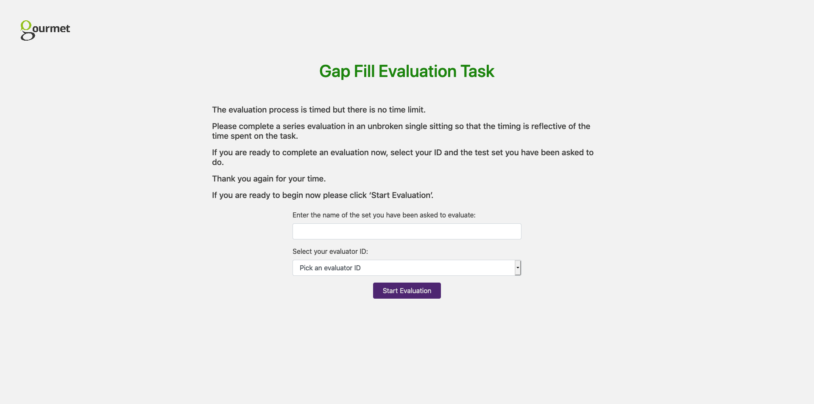

# User Guide

The app has two types of user 

- Evaluation Coordinators: Individuals running the evaluation. They are responsible for providing the data sets to be evaluated and reviewing the results of the evaluation
- Participants: Individuals completing the Gap Fill Task

## Evaluation Coordinators

The aspects of the UI relevant to the Evaluation Coordinator are shown on the home page. There is an option to submit data sets and view results


### Creating and Submitting a Data Set

#### Creating Data Sets for the App

The Data set must be a json file with the following structure:

```
{
    "id": "string",
    "sourceLanguage": "string",
    "targetLanguage": "string",
    "segments": ["SegmentObject"],
    "evaluatorIds": ["string"]
}
```

Where `SegmentObjects` have the following properties:

```
{
    "id": "string",
    "translationSystem": "string",
    "source": "string",
    "translation": "string",
    "hint": "string",
    "problem": "string",
    "gapDensity": "string",
    "context": "string",
    "entropyMode": "string",
    "correctAnswers": ["string"]
}
```

For Example:

```json
{
    "evaluatorIds": ["evaluator1", "evaluator2"],
    "segments": [
        {
        "id": "8f5df790-4996-11ea-983b-acde48001122",
        "translationSystem": "gourmet",
        "gapDensity": "20.0",
        "context": "-doc",
        "entropyMode": "-ent",
        "source": "Той трудно намира работници сред местните хора и се тревожи за бъдещето.",
        "hint": "He finds it hard to find workers among local people and worries about the future.",
        "translation": "He struggles to find enough local workers in rural Scotland to work in the field and is worried about the future.",
        "problem": "He struggles to find enough local workers in rural Scotland to work in the field and is worried about the { }.",
        "correctAnswers": ["future"]
        },
        {
        "id": "8f91f41e-4996-11ea-a072-acde48001122",
        "translationSystem": "NONE",
        "gapDensity": "20.0",
        "context": "-doc",
        "entropyMode": "-ent",
        "source": "Кадрите със скандалната целувка обиколиха света, тъй като музикантите споделиха в Инстаграм снимката с думите: 'Русия, обичаме те'.",
        "hint": "[Take your best guess]",
        "translation": "Images of the scandalous kiss went around the globe, with the group making sure they shared the moment on Instagram accompanied by the words: “Russia, we love you”.",
        "problem": "Images of the scandalous kiss went around the { }, with the group making { } they shared the { } on Instagram { } by the words: “{ }, we love you”.",
        "correctAnswers": ["globe", "sure", "moment", "accompanied", "Russia"]
        }
    ]
}
```

- possibleEvaluatorIds: A participant will select an evaluator ID when starting the exercise. This determines the list of evaluator IDs that will be available for a given data set. The Tool will always provide the evaluator ID 'tester'. This is used for testing purposes and should not be used by an actual participant as their scores will not be shown in the results
- evaluatorIds: a list of evaluator IDs of users who completed the exercise

This [script](https://gitlab.com/mlforcada/bbc-dw-gf) can be used to generate a data set.

#### Submitting a Data Set

The JSON data set is then uploaded on the 'submit data sets' page


### View Results

The View Results page allows the Evaluation Coordinator to export the results by language as a CSV file. It also shows which participants have **started** the Gap Fill Task.


## Participants

### 1. Starting the Task

Participants will be shown 2 pages covering the introduction to the Task


### 2. Selecting a Data Set and Evaluator ID

Participants will select a Set to evaluate and an Evaluator ID



### 3. Direct Assessment Tasks

Participants will be shown a series of gap fill exercises.


